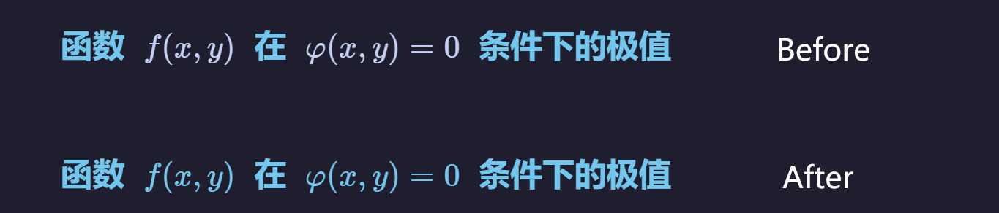

# LaTeX Color Sync

[English README](README.md)

## 这个插件到底做什么

这个插件会让公式颜色跟随附近文本颜色，在源码模式下自动把公式改写为：

`\\textcolor{#RRGGBB}{...}`

典型场景：标题、链接、引用文字有主题色时，公式也保持同色，不再突兀。



## 它有两种工作方式

### 1) 自动同步（边写边生效）

- 当你输入导致文档插入新行（`\\n`）时，插件会自动同步邻近公式颜色。
- 你可以在设置里关闭这个功能（适合超大文档或你只想手动控制时）。

### 2) 手动命令（按需触发）

你也可以通过命令面板手动执行同步，适合局部修正或一次性全量整理。

#### 两个命令分别干什么

| 命令 | 什么时候用 | 会改什么 |
| --- | --- | --- |
| `同步选中区域或当前行内的 LaTeX 颜色` | 你只想改一小段内容 | 改写选中行（或当前行）里的公式 |
| `同步当前文档中的 LaTeX 颜色` | 你想一次性整理整篇笔记 | 改写当前笔记中的公式 |

#### 推荐使用方式

1. 先用“同步选中区域或当前行”，确认效果符合你的习惯。
2. 再用“同步当前文档”，做全量整理。
3. 结果不满意随时 `Ctrl/Cmd+Z` 撤销。

## 配置项怎么选

| 配置项 | 默认 | 建议开启场景 | 建议关闭场景 |
| --- | --- | --- | --- |
| 语言 | `自动` | 跟随 Obsidian 语言即可 | 你想固定英文或中文 |
| 手动命令后显示摘要 | 开 | 你想知道每次改了多少 | 你不想被通知打断 |
| 插入新行时自动同步 | 开 | 你希望文档出现换行（`\\n`）时自动处理公式 | 文档很大，想减少输入时处理 |
| 插入新行时同时处理上一行 | 开 | 公式常在刚断开的上一行 | 你只想处理当前行 |
| 优先采样编辑器实际颜色 | 开 | 想尽量贴近当前主题显示效果 | 特殊主题下回退映射更稳定 |
| 覆盖已有顶层 LaTeX 颜色 | 开 | 你希望所有公式风格统一 | 你想保留手动设置的顶层颜色 |
| 跳过含内嵌颜色命令的公式 | 开 | 你担心复杂公式被意外套色 | 你明确希望连这类公式也被改写 |

## 为什么会提示“无变更”

常见原因：

- 目标行里没有合法的 `$...$` 或 `$$...$$` 公式。
- 公式颜色本来就已经一致。
- 公式在跳过区域里（代码块、行内代码、frontmatter、HTML 风格区域）。
- 公式内部已经有颜色命令，且你开启了“跳过含内嵌颜色命令的公式”。

## 兼容性

- Obsidian `>= 1.5.0`
- 支持桌面与移动端（`isDesktopOnly: false`）
- 仅针对源码模式编辑器（CodeMirror 6）

## 已知限制

- 公式起止符需在同一行内。
- 极端自定义宏或非常规定界符，仍可能需要手动微调。

## 开发与打包

源码可以分文件放在 `src/`，但发布产物必须是仓库根目录单文件 `main.js`。

1. 安装依赖：

```bash
npm install
```

2. 生产打包：

```bash
npm run build
```

3. 本地开发监听：

```bash
npm run dev
```

打包输入输出：

- 输入：`src/main.js`（以及 `src/` 中被引用模块）
- 输出：根目录 `main.js`（用于 Obsidian 社区发布的单文件）

## GitHub Actions 自动发布流程

仓库已包含 `.github/workflows/release.yml`：

- 触发方式：推送 Tag（如 `v0.3.2` 或 `0.3.2`）
- 执行动作：安装依赖、构建 `main.js`、上传 Release 资源
- 上传文件：`main.js`、`manifest.json`、`styles.css`

注意：Tag 版本号必须与 `manifest.json` 的 `version` 完全一致。

## 隐私

插件不会将笔记内容发送到外部服务，也不会采集遥测数据。

## 开源协作

- 变更记录：[CHANGELOG.md](CHANGELOG.md)
- 贡献指南：[CONTRIBUTING.md](CONTRIBUTING.md)
- Issue 模板：`.github/ISSUE_TEMPLATE/`

## 许可证

MIT，见 [LICENSE](LICENSE)。
